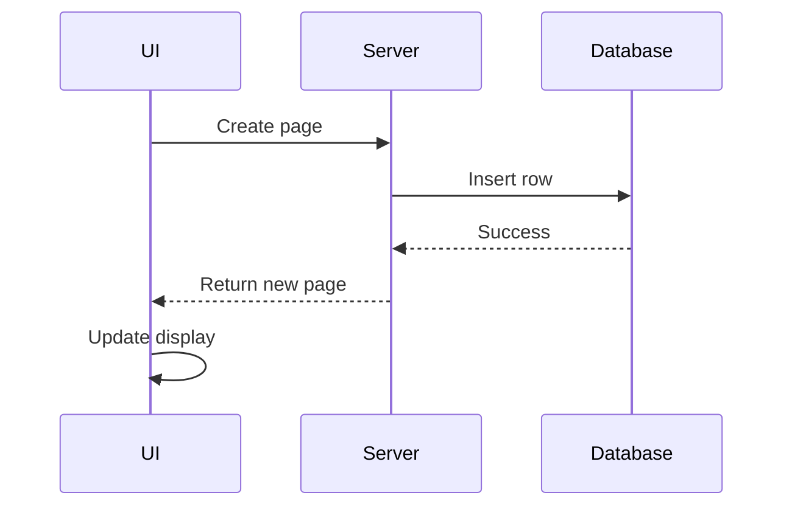
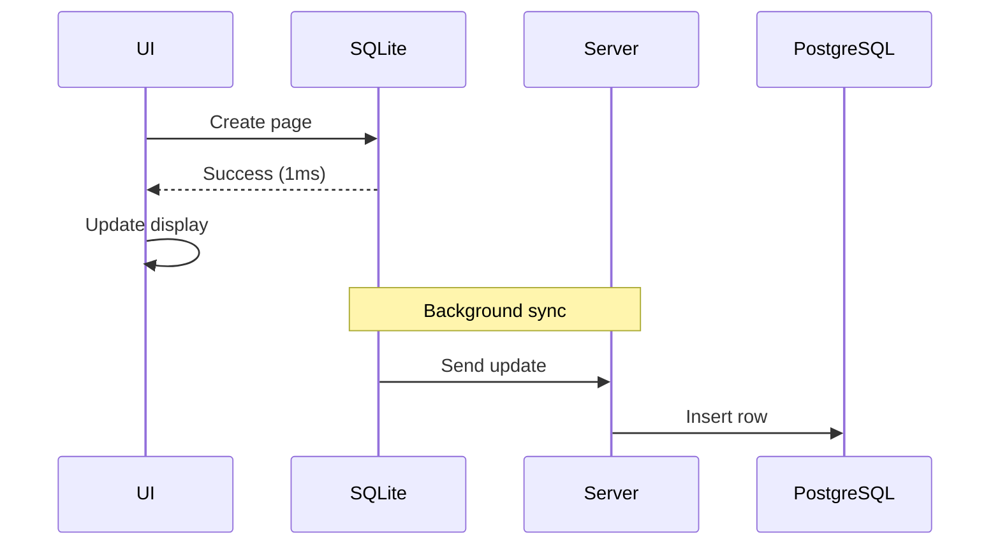

Brainbox's local-first architecture puts the client database at the center of the system, enabling offline functionality and instant UI updates.

## Overview

Every Brainbox client maintains a complete SQLite database that stores:

- Workspace nodes (spaces, folders, pages, databases, etc.)
- Rich text document states (Yjs CRDT)
- User profiles and workspace memberships
- Pending mutations and sync cursors
- File upload/download states

## Client Database Implementation

### Database Engines

Brainbox uses different SQLite implementations depending on the platform:

#### Web Application

```typescript
// packages/client/src/databases/workspace/index.ts
import { sqlite3Worker1Promiser } from '@sqlite.org/sqlite-wasm';

const worker = await sqlite3Worker1Promiser({
  onready: () => {
    console.log('SQLite WASM ready');
  },
});

const db = await worker('open', {
  filename: 'workspace.db',
  vfs: 'opfs', // Origin Private File System
});
```

**Key characteristics:**

- **SQLite WASM**: Compiled to WebAssembly, runs in browser
- **OPFS storage**: Origin Private File System for persistence
- **Worker thread**: Runs in Web Worker to avoid blocking UI
- **Size limit**: Browser storage quotas apply (typically several GB)

#### Desktop Application

```typescript
// Desktop uses better-sqlite3 (native)
import Database from 'better-sqlite3';

const db = new Database('workspace.db', {
  verbose: console.log,
});
```

**Key characteristics:**

- **better-sqlite3**: Native Node.js binding, fastest performance
- **Synchronous API**: Simpler programming model
- **File system**: Standard SQLite file on disk
- **No size limit**: Limited only by disk space

### Database Schema

The client database schema is defined in `packages/client/src/databases/workspace/schema.ts` and includes these core tables:

#### Users Table

```sql
CREATE TABLE users (
  id TEXT PRIMARY KEY,
  email TEXT NOT NULL,
  name TEXT NOT NULL,
  avatar TEXT,
  custom_name TEXT,
  custom_avatar TEXT,
  role TEXT NOT NULL,
  status TEXT NOT NULL,
  created_at TEXT NOT NULL,
  updated_at TEXT,
  revision TEXT NOT NULL
);
```

Stores workspace members and their profiles.

#### Nodes Table

```sql
CREATE TABLE nodes (
  id TEXT PRIMARY KEY,
  type TEXT NOT NULL,
  parent_id TEXT,
  root_id TEXT NOT NULL,
  attributes TEXT NOT NULL,
  local_revision TEXT NOT NULL,
  server_revision TEXT NOT NULL,
  created_at TEXT NOT NULL,
  updated_at TEXT,
  created_by TEXT NOT NULL,
  updated_by TEXT,
  FOREIGN KEY (parent_id) REFERENCES nodes(id)
);

CREATE INDEX idx_nodes_parent ON nodes(parent_id);
CREATE INDEX idx_nodes_root ON nodes(root_id);
CREATE INDEX idx_nodes_type ON nodes(type);
```

Stores all workspace entities (spaces, folders, pages, databases, records, etc.).

**Key fields:**

- `attributes`: JSON string of node-specific data
- `local_revision`: Revision number for local changes
- `server_revision`: Last known server revision
- `root_id`: Top-level container (workspace or space)

#### Node States Table

```sql
CREATE TABLE node_states (
  id TEXT PRIMARY KEY,
  state BLOB NOT NULL,
  revision TEXT NOT NULL,
  FOREIGN KEY (id) REFERENCES nodes(id)
);
```

Stores Yjs CRDT states for rich text documents.

- `state`: Binary Yjs state vector
- `revision`: Version tracking for sync

#### Node Updates Table

```sql
CREATE TABLE node_updates (
  id TEXT PRIMARY KEY,
  node_id TEXT NOT NULL,
  data BLOB NOT NULL,
  created_at TEXT NOT NULL,
  FOREIGN KEY (node_id) REFERENCES nodes(id)
);

CREATE INDEX idx_node_updates_node ON node_updates(node_id);
```

Local queue of pending Yjs updates to sync to server.

#### Mutations Table

```sql
CREATE TABLE mutations (
  id TEXT PRIMARY KEY,
  type TEXT NOT NULL,
  input TEXT NOT NULL,
  status TEXT NOT NULL,
  error TEXT,
  retry_count INTEGER DEFAULT 0,
  created_at TEXT NOT NULL
);

CREATE INDEX idx_mutations_status ON mutations(status);
```

Queue of pending mutations to sync to server.

**Status values:**

- `pending`: Not yet sent to server
- `in_progress`: Currently syncing
- `completed`: Successfully synced
- `failed`: Sync failed, may retry

### Database Migrations

Migrations are stored in `packages/client/src/databases/workspace/migrations/` and run sequentially:

```typescript
// Example migration file
export async function up(db: Kysely<any>): Promise<void> {
  await db.schema
    .createTable('users')
    .addColumn('id', 'text', (col) => col.primaryKey())
    .addColumn('email', 'text', (col) => col.notNull())
    .addColumn('name', 'text', (col) => col.notNull())
    .addColumn('created_at', 'text', (col) => col.notNull())
    .execute();
}
```

Migrations are tracked in the `migrations` table to prevent re-running.

## Query Layer

Queries are implemented in `packages/client/src/queries/` using Kysely for type safety:

```typescript
// Example: Query nodes by parent
import { queryNodes } from '@brainbox/client/queries';

const nodes = await queryNodes({
  type: 'nodes.list',
  workspaceId: 'workspace_123',
  parentId: 'folder_456',
});
```

### Query Types

- `nodes.list`: Fetch nodes by parent, type, or filters
- `nodes.get`: Get single node by ID
- `nodes.search`: Full-text search across nodes
- `users.list`: Fetch workspace members
- `collaborations.list`: Get workspace memberships

All queries read from the local SQLite database - no network requests.

## Mutation Layer

Mutations write to the local database first, then queue for server sync:

```typescript
// Example: Create a new page
import { createNode } from '@brainbox/client/mutations';

const result = await createNode({
  type: 'nodes.create',
  workspaceId: 'workspace_123',
  nodeType: 'page',
  parentId: 'folder_456',
  attributes: {
    name: 'My New Page',
    icon: '📄',
  },
});

if (result.success) {
  console.log('Created node:', result.data.id);
  // UI updates immediately with local data
  // Background sync will send to server
}
```

### Mutation Flow

1. **Validation**: Check permissions and validate input with Zod
2. **Local Write**: Insert/update/delete in SQLite database
3. **Queue Mutation**: Add to `mutations` table with `pending` status
4. **Optimistic Update**: Return success to UI immediately
5. **Background Sync**: Sync engine processes mutation queue
6. **Server Response**: Update mutation status to `completed` or `failed`
7. **Conflict Resolution**: Apply server version if conflicts detected

### Mutation Types

- `nodes.create`: Create new node
- `nodes.update`: Update node attributes
- `nodes.delete`: Soft-delete node (tombstone)
- `nodes.move`: Change parent or position
- `document.update`: Update rich text content

## Offline Operation

### How It Works

1. **Immediate Writes**: All changes write to local SQLite
2. **Mutation Queue**: Pending changes stored in `mutations` table
3. **Connection Detection**: Client detects online/offline status
4. **Automatic Retry**: When reconnected, queue processes automatically
5. **Conflict Resolution**: CRDTs handle concurrent edits

### Offline Capabilities

**Fully functional offline:**

- Create, edit, delete pages and databases
- Rich text editing with full formatting
- Search across all local content
- Navigate workspace hierarchy
- View user profiles

**Requires connection:**

- File uploads (queued when offline)
- Workspace invitations
- Real-time collaboration presence
- Server-side search/AI features

### Connection Status

```typescript
// Client tracks connection state
const { isOnline, isConnected } = useConnectionStatus();

// isOnline: Browser navigator.onLine
// isConnected: WebSocket connection established
```

UI shows connection status and queued mutations count.

## Data Persistence

### Browser (Web App)

- **Storage**: Origin Private File System (OPFS)
- **Quota**: Managed by browser, typically 10% of available disk
- **Eviction**: Marked as "persistent" to prevent automatic eviction
- **Access**: Only accessible to same origin (security)

```typescript
// Request persistent storage
if (navigator.storage && navigator.storage.persist) {
  const isPersisted = await navigator.storage.persist();
  console.log('Storage persisted:', isPersisted);
}
```

### Desktop App

- **Storage**: Standard SQLite file in user data directory
- **Location**: `~/Library/Application Support/Brainbox/` (macOS)
- **Quota**: No limit (uses available disk space)
- **Backup**: Users can backup SQLite file directly

### Database Size

Typical workspace database sizes:

- **Small workspace** (100 pages): 5-10 MB
- **Medium workspace** (1,000 pages): 50-100 MB
- **Large workspace** (10,000 pages): 500 MB - 1 GB

Rich text content and node attributes are stored as compressed JSON.

## Sync Cursors

The client tracks sync progress for each data stream:

```sql
CREATE TABLE sync_cursors (
  key TEXT PRIMARY KEY,
  cursor TEXT NOT NULL,
  updated_at TEXT NOT NULL
);
```

**Cursor keys:**

- `nodes.updates:{rootId}`: Last synced node revision
- `document.updates:{nodeId}`: Last synced document revision
- `users:{workspaceId}`: Last synced user revision

Cursors enable incremental sync - only fetch changes since last sync.

## Data Initialization

When a client first connects to a workspace:

1. **Create Database**: Initialize empty SQLite database
2. **Run Migrations**: Execute all migration scripts
3. **Initial Sync**: Request full workspace state from server
4. **Populate Database**: Insert all nodes, users, memberships
5. **Set Cursors**: Record initial sync positions
6. **Subscribe**: Start listening for incremental updates

```typescript
// packages/client/src/databases/workspace/index.ts
export async function openDatabase(workspaceId: string) {
  const db = await initializeDatabase(workspaceId);
  await runMigrations(db);
  await initialSync(db, workspaceId);
  return db;
}
```

## Performance Optimization

### Indexing Strategy

Critical indexes for query performance:

```sql
-- Node hierarchy traversal
CREATE INDEX idx_nodes_parent ON nodes(parent_id);
CREATE INDEX idx_nodes_root ON nodes(root_id);

-- Filtering by type
CREATE INDEX idx_nodes_type ON nodes(type);

-- Mutation queue processing
CREATE INDEX idx_mutations_status ON mutations(status);
```

### Query Caching

TanStack Query caches results in memory:

```typescript
const { data: nodes } = useQuery({
  queryKey: ['nodes', 'list', { parentId }],
  queryFn: () => queryNodes({ type: 'nodes.list', parentId }),
  staleTime: 60000, // 1 minute
});
```

Cache invalidation on local mutations ensures consistency.

### Batch Operations

Mutations can be batched for efficiency:

```typescript
await db.transaction(async (trx) => {
  for (const node of nodesToCreate) {
    await trx.insertInto('nodes').values(node).execute();
  }
});
```

Transactions ensure atomicity and improve performance.

## Comparison: Local-First vs Traditional

### Traditional (Server-First)



**Latency**: 100-500ms (network + database)

### Local-First (Brainbox)



**Latency**: Under 10ms (local database only)

## Best Practices

### When to Use Local-First

**Ideal for:**

- Note-taking and document editing
- Project management tools
- Collaborative workspaces
- Mobile apps with poor connectivity

**Not ideal for:**

- Financial transactions (require server confirmation)
- Real-time trading systems
- Systems requiring strong consistency guarantees

### Client Database Maintenance

1. **Vacuum periodically**: Reclaim space from deleted data
2. **Analyze tables**: Update query planner statistics
3. **Monitor size**: Warn users of large databases
4. **Backup option**: Export workspace data

## Next Steps

- [Sync Engine](/architecture/sync-engine) - How local changes sync to server
- [CRDT Implementation](/architecture/crdt) - Conflict-free merging with Yjs
- [Monorepo Structure](/architecture/monorepo) - Client package organization
