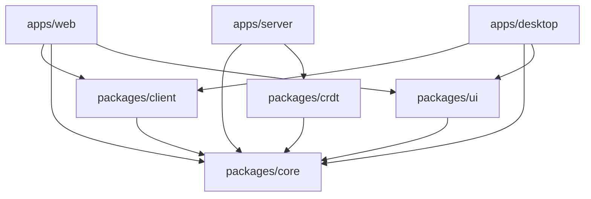

Brainbox uses a Turborepo-powered monorepo to manage multiple applications and shared packages with efficient builds and dependency management.

## Repository Structure

```
brainbox/
├── apps/
│   ├── server/          # Fastify API server
│   ├── web/             # React web application
│   └── desktop/         # Electron desktop app
├── packages/
│   ├── core/            # Shared types and business logic
│   ├── crdt/            # Yjs CRDT implementation
│   ├── client/          # Client sync engine and database
│   └── ui/              # Shared component library
├── scripts/             # Build and maintenance scripts
├── hosting/
│   ├── docker/          # Docker Compose setup
│   └── kubernetes/      # Kubernetes manifests
├── docs/                # Documentation files
├── package.json         # Root package configuration
├── turbo.json           # Turborepo configuration
└── tsconfig.base.json   # Shared TypeScript config
```

## Package Manager

Brainbox uses **npm workspaces** for dependency management:

```json
// package.json
{
  "name": "brainbox",
  "version": "1.0.0",
  "private": true,
  "workspaces": [
    "packages/*",
    "apps/*",
    "scripts"
  ],
  "packageManager": "npm@10.9.0"
}
```

All packages are linked and installed from the root:

```bash
npm install  # Installs dependencies for all workspaces
```

## Turborepo Configuration

Location: `turbo.json`

```json
{
  "$schema": "https://turbo.build/schema.json",
  "tasks": {
    "build": {
      "dependsOn": ["^build"],
      "outputs": ["dist/**", "out/**", "assets/**"]
    },
    "lint": {
      "dependsOn": ["^lint"]
    },
    "test": {
      "dependsOn": ["^build"],
      "outputs": ["coverage/**"],
      "inputs": ["src/**/*.tsx", "src/**/*.ts", "test/**/*.ts", "test/**/*.tsx"]
    },
    "compile": {
      "dependsOn": ["^build"]
    },
    "clean": {
      "dependsOn": ["^clean"]
    }
  }
}
```

### Task Dependencies

- `^build`: Depends on dependencies being built first
- `dependsOn`: Ensures correct execution order
- `outputs`: Cached build artifacts
- `inputs`: Files that trigger rebuilds

## Applications

### apps/server

**Fastify API server** with WebSocket support for real-time sync.

Location: `apps/server/`

#### Package Configuration

```json
{
  "name": "@brainbox/server",
  "version": "1.1.0",
  "type": "module",
  "main": "./dist/index.js",
  "scripts": {
    "dev": "tsx watch --env-file .env src/index.ts",
    "build": "npm run compile && tsup-node",
    "compile": "tsc --noEmit"
  },
  "dependencies": {
    "@brainbox/core": "*",
    "@brainbox/crdt": "*",
    "fastify": "^5.4.0",
    "@fastify/websocket": "^11.2.0",
    "kysely": "^0.28.4",
    "pg": "^8.16.3",
    "yjs": "^13.6.27"
  }
}
```

#### Directory Structure

```
apps/server/src/
├── api/
│   ├── client/          # Client API routes
│   ├── public/          # Public API routes
│   └── internal/        # Internal API routes
├── data/
│   ├── database.ts      # PostgreSQL connection
│   ├── redis.ts         # Redis connection
│   ├── migrations/      # Database migrations
│   └── schema.ts        # Kysely schema types
├── jobs/
│   ├── processors/      # BullMQ job processors
│   └── queues.ts        # Job queue definitions
├── services/
│   ├── socket-service.ts
│   ├── socket-connection.ts
│   ├── email-service.ts
│   └── job-service.ts
├── synchronizers/
│   ├── base.ts
│   ├── node-updates.ts
│   ├── document-updates.ts
│   └── users.ts
├── lib/
│   ├── logger.ts
│   ├── event-bus.ts
│   └── auth.ts
├── app.ts               # Fastify app setup
└── index.ts             # Entry point
```

#### Key Features

- **REST API**: HTTP endpoints for authentication, file uploads
- **WebSocket API**: Real-time sync protocol
- **Background jobs**: Email, file processing, cleanup
- **Database migrations**: Schema versioning

### apps/web

**React web application** with SQLite WASM.

Location: `apps/web/`

#### Package Configuration

```json
{
  "name": "@brainbox/web",
  "private": true,
  "type": "module",
  "scripts": {
    "dev": "vite --port 4000",
    "build": "vite build && tsc",
    "compile": "tsc --noEmit"
  },
  "dependencies": {
    "@brainbox/client": "*",
    "@brainbox/core": "*",
    "@brainbox/ui": "*",
    "@sqlite.org/sqlite-wasm": "^3.50.3-build1",
    "react": "^19",
    "vite": "^7.1.5"
  }
}
```

#### Directory Structure

```
apps/web/src/
├── components/
│   ├── editor/          # Rich text editor
│   ├── database/        # Database views
│   ├── sidebar/         # Navigation sidebar
│   └── shared/          # Shared components
├── pages/
│   ├── workspace/       # Main workspace view
│   ├── auth/            # Login/register
│   └── settings/        # User settings
├── hooks/
│   ├── use-database.ts
│   ├── use-sync.ts
│   └── use-nodes.ts
├── lib/
│   ├── database.ts      # SQLite WASM setup
│   └── sync.ts          # WebSocket connection
├── workers/
│   └── sqlite.worker.ts # SQLite in Web Worker
├── App.tsx
└── main.tsx
```

#### Key Features

- **SQLite WASM**: Browser-based database with OPFS storage
- **Service Worker**: Offline support and caching
- **PWA**: Installable progressive web app
- **Code splitting**: Lazy-loaded routes

### apps/desktop

**Electron desktop application** with native SQLite.

Location: `apps/desktop/`

#### Package Configuration

```json
{
  "name": "@brainbox/desktop",
  "productName": "Brainbox",
  "version": "1.1.0",
  "main": ".vite/build/main.js",
  "scripts": {
    "dev": "electron-forge start",
    "package": "electron-forge package",
    "make": "electron-forge make"
  },
  "dependencies": {
    "@brainbox/client": "*",
    "@brainbox/core": "*",
    "@brainbox/ui": "*",
    "better-sqlite3": "^12.2.0",
    "electron": "^37.2.6"
  }
}
```

#### Directory Structure

```
apps/desktop/src/
├── main/
│   ├── index.ts         # Main process entry
│   ├── database.ts      # better-sqlite3 setup
│   ├── ipc.ts           # IPC handlers
│   └── menu.ts          # Application menu
├── preload/
│   └── index.ts         # Preload script
└── renderer/
    └── index.html       # Renderer HTML
```

#### Key Features

- **better-sqlite3**: Native SQLite performance
- **IPC communication**: Main/renderer process bridge
- **Auto-update**: Electron's built-in updater
- **Native menus**: OS-native application menus

## Shared Packages

### packages/core

**Shared types, schemas, and business logic** used across all apps.

Location: `packages/core/`

#### Package Configuration

```json
{
  "name": "@brainbox/core",
  "version": "1.0.0",
  "type": "module",
  "types": "./src/index.ts",
  "exports": {
    ".": "./src/index.ts"
  },
  "dependencies": {
    "zod": "^4.0.15",
    "ulid": "^3.0.1"
  }
}
```

#### Directory Structure

```
packages/core/src/
├── registry/
│   ├── nodes/           # Node type definitions
│   │   ├── space.ts
│   │   ├── folder.ts
│   │   ├── page.ts
│   │   ├── database.ts
│   │   └── ...
│   └── index.ts
├── synchronizers/       # Sync type definitions
│   ├── nodes-updates.ts
│   ├── document-updates.ts
│   └── index.ts
├── types/
│   ├── nodes.ts
│   ├── users.ts
│   └── workspaces.ts
├── lib/
│   ├── id.ts            # ID generation
│   ├── permissions.ts   # Authorization logic
│   └── validation.ts    # Zod schemas
└── index.ts
```

#### Exports

```typescript
// Type-safe imports from core
import {
  NodeType,
  WorkspaceRole,
  generateId,
  nodeSchema,
} from '@brainbox/core';
```

### packages/crdt

**Yjs CRDT wrapper** for conflict-free merging.

Location: `packages/crdt/`

#### Package Configuration

```json
{
  "name": "@brainbox/crdt",
  "version": "1.0.0",
  "type": "module",
  "types": "./src/index.ts",
  "exports": {
    ".": "./src/index.ts"
  },
  "dependencies": {
    "@brainbox/core": "^1.0.0",
    "yjs": "^13.6.27",
    "diff": "^8.0.2"
  }
}
```

#### Exports

```typescript
import {
  YDoc,
  encodeState,
  decodeState,
  mergeUpdates,
} from '@brainbox/crdt';
```

### packages/client

**Client sync engine, database, queries, and mutations.**

Location: `packages/client/`

#### Package Configuration

```json
{
  "name": "@brainbox/client",
  "version": "1.1.0",
  "type": "module",
  "exports": {
    "./types": "./src/types/index.ts",
    "./handlers": "./src/handlers/index.ts",
    "./databases": "./src/databases/index.ts",
    "./services": "./src/services/index.ts",
    "./queries": "./src/queries/index.ts",
    "./mutations": "./src/mutations/index.ts",
    "./commands": "./src/commands/index.ts"
  },
  "dependencies": {
    "@brainbox/core": "*",
    "kysely": "^0.28.4",
    "ky": "^1.8.2"
  }
}
```

#### Directory Structure

```
packages/client/src/
├── databases/
│   ├── workspace/
│   │   ├── migrations/
│   │   ├── schema.ts
│   │   └── index.ts
│   ├── account/
│   └── index.ts
├── handlers/
│   ├── mutations/       # Mutation handlers
│   ├── queries/         # Query handlers
│   ├── mediator.ts      # Message routing
│   └── index.ts
├── queries/
│   ├── nodes/
│   ├── users/
│   └── index.ts
├── mutations/
│   ├── nodes/
│   ├── documents/
│   └── index.ts
├── services/
│   ├── app-service.ts
│   └── sync-service.ts
└── index.ts
```

#### Usage

```typescript
import { openDatabase } from '@brainbox/client/databases';
import { queryNodes } from '@brainbox/client/queries';
import { createNode } from '@brainbox/client/mutations';

const db = await openDatabase(workspaceId);
const nodes = await queryNodes({ type: 'nodes.list', parentId });
await createNode({ type: 'nodes.create', nodeType: 'page' });
```

### packages/ui

**Shared component library** built on Radix UI.

Location: `packages/ui/`

#### Package Configuration

```json
{
  "name": "@brainbox/ui",
  "version": "1.0.0",
  "type": "module",
  "exports": {
    ".": "./src/index.ts"
  },
  "dependencies": {
    "@radix-ui/react-dialog": "^1.1.4",
    "@radix-ui/react-dropdown-menu": "^2.2.0",
    "react": "^19"
  }
}
```

#### Components

```
packages/ui/src/
├── components/
│   ├── button.tsx
│   ├── dialog.tsx
│   ├── dropdown.tsx
│   ├── input.tsx
│   └── ...
├── hooks/
│   ├── use-toast.ts
│   └── use-theme.ts
└── index.ts
```

#### Usage

```typescript
import { Button, Dialog, Input } from '@brainbox/ui';

<Button variant="primary">Save</Button>
```

## Dependency Graph



## Build System

### TypeScript Configuration

Shared base configuration:

```json
// tsconfig.base.json
{
  "compilerOptions": {
    "target": "ES2022",
    "module": "ESNext",
    "moduleResolution": "bundler",
    "strict": true,
    "esModuleInterop": true,
    "skipLibCheck": true,
    "resolveJsonModule": true
  }
}
```

Packages extend base config:

```json
// packages/core/tsconfig.json
{
  "extends": "../../tsconfig.base.json",
  "compilerOptions": {
    "outDir": "dist",
    "rootDir": "src"
  },
  "include": ["src/**/*"]
}
```

### Build Tools

- **tsup**: Fast TypeScript bundler for packages
- **Vite**: Fast build tool for web app
- **Electron Forge**: Desktop app packaging
- **tsx**: TypeScript execution for server dev mode

### Build Commands

```bash
# Build all packages and apps
npm run build

# Build specific package
npm run build --filter=@brainbox/core

# Watch mode for development
npm run watch --filter=@brainbox/{core,crdt,server}

# Type-check entire codebase
npm run compile
```

## Development Workflow

### Starting Development Servers

```bash
# Terminal 1: Start all infrastructure
docker compose -f hosting/docker/docker-compose.yaml up -d

# Terminal 2: Start all dev servers
npm run dev

# This runs:
# - apps/server on port 3000
# - apps/web on port 4000
# - Watches packages for changes
```

### Adding a New Package

1. Create package directory:

```bash
mkdir -p packages/my-package/src
```

2. Add `package.json`:

```json
{
  "name": "@brainbox/my-package",
  "version": "1.0.0",
  "type": "module",
  "exports": {
    ".": "./src/index.ts"
  }
}
```

3. Add `tsconfig.json`:

```json
{
  "extends": "../../tsconfig.base.json",
  "include": ["src/**/*"]
}
```

4. Install from root:

```bash
npm install
```

### Internal Package Dependencies

Reference other workspace packages using `*` version:

```json
{
  "dependencies": {
    "@brainbox/core": "*",
    "@brainbox/crdt": "*"
  }
}
```

Turborepo handles build order automatically.

## Testing

All packages use Vitest:

```bash
# Run all tests
npm run test

# Watch mode
npm run test -- --watch

# Test specific package
npm run test --filter=@brainbox/core

# Coverage
npm run coverage
```

Test files:
```
packages/core/src/
├── lib/
│   ├── id.ts
│   └── id.test.ts
```

## Linting and Formatting

### ESLint Configuration

Root `.eslintrc.json`:

```json
{
  "extends": [
    "eslint:recommended",
    "plugin:@typescript-eslint/recommended",
    "prettier"
  ],
  "parser": "@typescript-eslint/parser",
  "plugins": ["@typescript-eslint"],
  "root": true
}
```

### Prettier Configuration

`.prettierrc`:

```json
{
  "semi": true,
  "singleQuote": true,
  "tabWidth": 2,
  "trailingComma": "es5"
}
```

### Commands

```bash
npm run lint          # Lint all packages
npm run format        # Format all files
npm run format:check  # Check formatting
```

## Continuous Integration

GitHub Actions workflow:

```yaml
name: CI
on: [push, pull_request]
jobs:
  build:
    runs-on: ubuntu-latest
    steps:
      - uses: actions/checkout@v3
      - uses: actions/setup-node@v3
        with:
          node-version: 18
      - run: npm install
      - run: npm run lint
      - run: npm run compile
      - run: npm run test
      - run: npm run build
```

## Performance

### Build Caching

Turborepo caches build outputs:

```bash
# First build
npm run build  # Takes 60s

# Subsequent builds (no changes)
npm run build  # Takes <1s (cached)
```

Cache stored in `.turbo/`.

### Parallel Execution

Independent tasks run in parallel:

```bash
npm run test
# Runs tests for all packages simultaneously
```

## Best Practices

### Package Organization

- **Keep packages focused**: Each package has a single responsibility
- **Minimize dependencies**: Avoid circular dependencies
- **Export intentionally**: Use explicit exports in package.json

### Versioning

- **Workspace protocol**: Use `*` for internal dependencies
- **Semantic versioning**: Follow semver for public packages
- **Coordinated releases**: Version all packages together

### Code Sharing

- **Core for shared logic**: Put reusable code in `@brainbox/core`
- **Avoid duplication**: Extract common patterns to packages
- **Type safety**: Use TypeScript across all packages

## Next Steps

- [Architecture Overview](/architecture/overview) - High-level system design
- [Local-First Architecture](/architecture/local-first) - Client databases
- [Sync Engine](/architecture/sync-engine) - WebSocket sync protocol
- [CRDT Implementation](/architecture/crdt) - Conflict resolution
