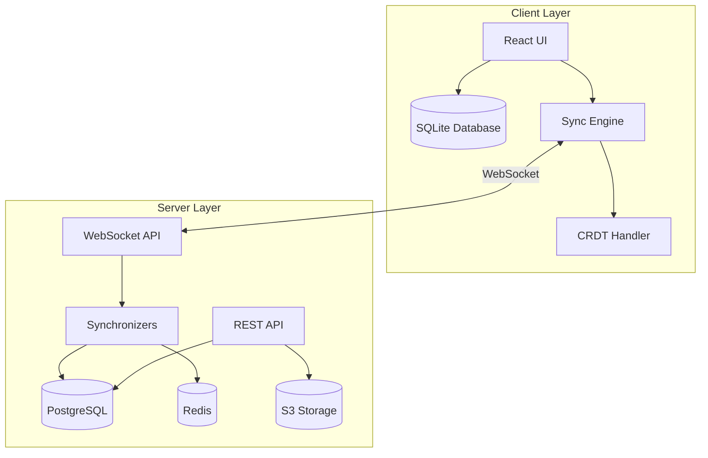
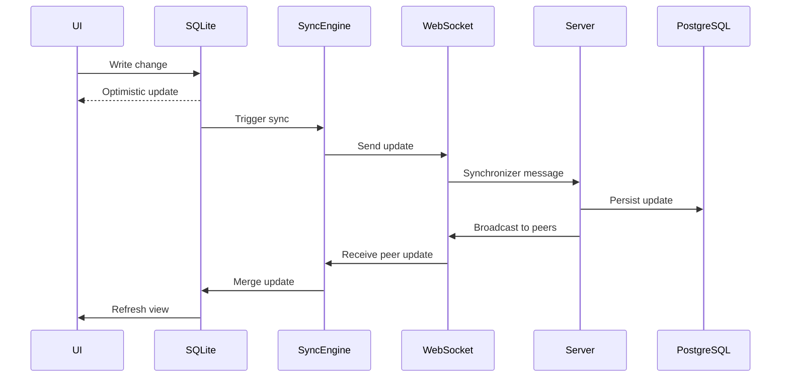

Brainbox is a local-first collaboration workspace built on a distributed architecture that prioritizes offline functionality, real-time synchronization, and conflict-free collaboration.

## Core Architecture Principles

### Local-First Design

Brainbox follows a local-first architecture where:

- **Client owns the data**: Each client maintains a complete SQLite database
- **Local writes first**: All operations write to the local database immediately
- **Offline capable**: Full functionality without internet connection
- **Background sync**: Changes synchronize to server when connected
- **Server as coordinator**: PostgreSQL server maintains the source of truth

### System Architecture



## Technology Stack

### Frontend

- **React 19**: UI framework with modern hooks and concurrent features
- **TypeScript**: Type-safe development across the entire codebase
- **TailwindCSS v4**: Utility-first styling
- **Vite**: Fast build tool and development server
- **TanStack Query**: Server state management

### Backend

- **Fastify**: High-performance HTTP framework
- **WebSocket**: Real-time bidirectional communication
- **PostgreSQL**: Server-side source of truth with pgvector extension
- **Redis**: Pub/sub and caching layer
- **BullMQ**: Background job processing
- **S3**: File storage (MinIO for self-hosted)

### Client Database

- **SQLite WASM**: Browser-based database (web app)
- **better-sqlite3**: Native SQLite (Electron desktop)
- **Kysely**: Type-safe SQL query builder

### Collaboration

- **Yjs**: CRDT implementation for conflict-free merging
- **TipTap**: Rich text editor built on ProseMirror

## Data Flow

### Write Operations

1. **User Action**: User makes a change in the UI
2. **Local Mutation**: Change written to local SQLite database
3. **CRDT Update**: Yjs generates a CRDT update for the change
4. **Optimistic UI**: UI updates immediately with local data
5. **Sync to Server**: Background sync sends update via WebSocket
6. **Server Processing**: Server applies update to PostgreSQL
7. **Broadcast**: Server broadcasts change to other connected clients
8. **Client Merge**: Other clients receive and merge the update

### Read Operations

1. **Query Local DB**: All reads query the local SQLite database
2. **Immediate Response**: No network latency for read operations
3. **Background Sync**: Subscribe to server updates for the queried data
4. **Incremental Updates**: Receive and apply updates as they arrive

### Sync Flow



## Key Components

### Packages

#### `@brainbox/core`

Shared types, utilities, and business logic used across client and server.

- **Node registry**: Definitions for all entity types (space, folder, page, database, etc.)
- **Zod schemas**: Runtime validation for all data structures
- **Synchronizer types**: Type definitions for sync protocol
- **Permissions**: Authorization logic for node operations

#### `@brainbox/crdt`

Yjs-based CRDT implementation for conflict resolution.

- **YDoc wrapper**: High-level API around Yjs documents
- **State encoding/decoding**: Binary state serialization
- **Update merging**: Combining multiple CRDT updates
- **Undo/redo**: History management

#### `@brainbox/client`

Client-side sync engine and database management.

- **Databases**: SQLite database initialization and migrations
- **Queries**: Type-safe query builders
- **Mutations**: Local write operations
- **Handlers**: WebSocket message handlers
- **Services**: Client-side business logic

#### `@brainbox/ui`

Shared component library built on Radix UI primitives.

- **Components**: Buttons, dialogs, forms, etc.
- **TailwindCSS**: Consistent styling
- **Accessibility**: ARIA-compliant components

### Applications

#### `apps/web`

React web application served at port 4000 in development.

- **SQLite WASM**: Browser-based database
- **Service Worker**: Offline support and caching
- **PWA**: Progressive web app capabilities

#### `apps/desktop`

Electron desktop application with native SQLite.

- **better-sqlite3**: Native database performance
- **IPC**: Main/renderer process communication
- **Auto-update**: Electron's update mechanism

#### `apps/server`

Fastify API server (port 3000) with WebSocket support.

- **REST API**: HTTP endpoints for auth, uploads, etc.
- **WebSocket API**: Real-time sync protocol
- **Synchronizers**: Broadcast logic for different data types
- **Jobs**: Background processing with BullMQ
- **Migrations**: Database schema versioning

## Node System

Brainbox uses a unified "node" abstraction for all entities:

- `space`: Top-level workspace container
- `folder`: Hierarchical organization
- `page`: Rich text documents
- `database`: Structured data collections
- `database-view`: Different views of databases (table, kanban, calendar)
- `record`: Database rows
- `field`: Database columns
- `file`: Uploaded files
- `channel`: Chat channels
- `message`: Chat messages

Each node type is defined in `packages/core/src/registry/nodes/` with:

- **Zod schema**: Type-safe attributes
- **Permissions**: CRUD authorization rules
- **Text extraction**: Search indexing
- **Mention extraction**: Reference tracking

## Synchronization Types

The sync protocol supports multiple data streams:

- `nodes.updates`: Node creation, updates, deletion
- `document.updates`: Rich text document changes (Yjs)
- `collaborations`: Workspace membership changes
- `node.reactions`: Emoji reactions
- `node.interactions`: Presence and viewing activity
- `node.tombstones`: Soft deletion tracking
- `users`: User profile updates

Each sync type has:

- **Schema** in `packages/core/src/synchronizers/`
- **Client handler** in `packages/client/src/handlers/`
- **Server broadcaster** in `apps/server/src/synchronizers/`

## Development Workflow

### Turbo Monorepo

Brainbox uses Turborepo for efficient monorepo management:

- **Dependency graph**: Automatically builds packages in correct order
- **Caching**: Reuses build outputs across runs
- **Parallel execution**: Runs independent tasks concurrently
- **Watch mode**: Incremental rebuilds during development

### Key Commands

```bash
npm run dev      # Start all development servers
npm run build    # Build all packages and apps
npm run test     # Run all tests with Vitest
npm run compile  # Type-check entire codebase
npm run lint     # Lint and format code
npm run clean    # Remove build artifacts
```

## Security Model

### Authentication

- **JWT tokens**: Stored in HTTPOnly cookies
- **Device-based**: Each client has a unique device ID
- **Session management**: Redis-backed sessions

### Authorization

- **Workspace-level**: Admin, member, viewer roles
- **Node-level**: Per-node permissions checked in core package
- **Client-side enforcement**: UI hides unauthorized actions
- **Server-side validation**: All operations validated on server

### Data Security

- **Transport**: TLS/HTTPS for all communications
- **At rest**: Server database encryption (depends on deployment)
- **File storage**: Signed S3 URLs with expiration

## Deployment

### Docker Compose

Simplest deployment for small teams:

```bash
docker compose -f hosting/docker/docker-compose.yaml up -d
```

Includes PostgreSQL, Redis, MinIO, and the Brainbox server.

### Kubernetes

Production-ready deployment with Helm charts:

```bash
helm install brainbox brainbox/brainbox
```

Supports horizontal scaling, managed databases, and cloud storage.

## Performance Characteristics

### Client Performance

- **Local reads**: Under 1ms from SQLite
- **Local writes**: Under 10ms to SQLite + optimistic UI
- **Sync latency**: 50-200ms to server (network dependent)

### Server Performance

- **WebSocket connections**: 10,000+ concurrent connections per instance
- **Write throughput**: 1,000+ operations/second to PostgreSQL
- **Broadcast latency**: Under 50ms to connected clients

### Scalability

- **Horizontal scaling**: Multiple server instances behind load balancer
- **Redis pub/sub**: Cross-instance event propagation
- **Database sharding**: Future enhancement for very large deployments

## Next Steps

- [Local-First Architecture](/architecture/local-first) - Deep dive into client databases
- [Sync Engine](/architecture/sync-engine) - WebSocket sync protocol details
- [CRDT Implementation](/architecture/crdt) - Conflict resolution with Yjs
- [Monorepo Structure](/architecture/monorepo) - Turbo monorepo organization
