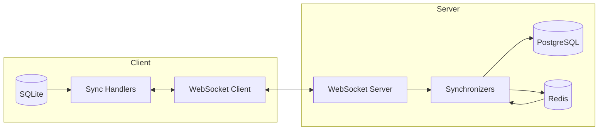
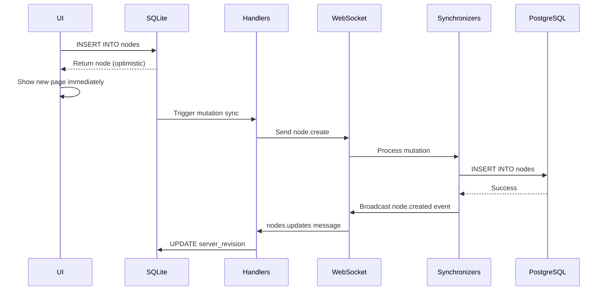
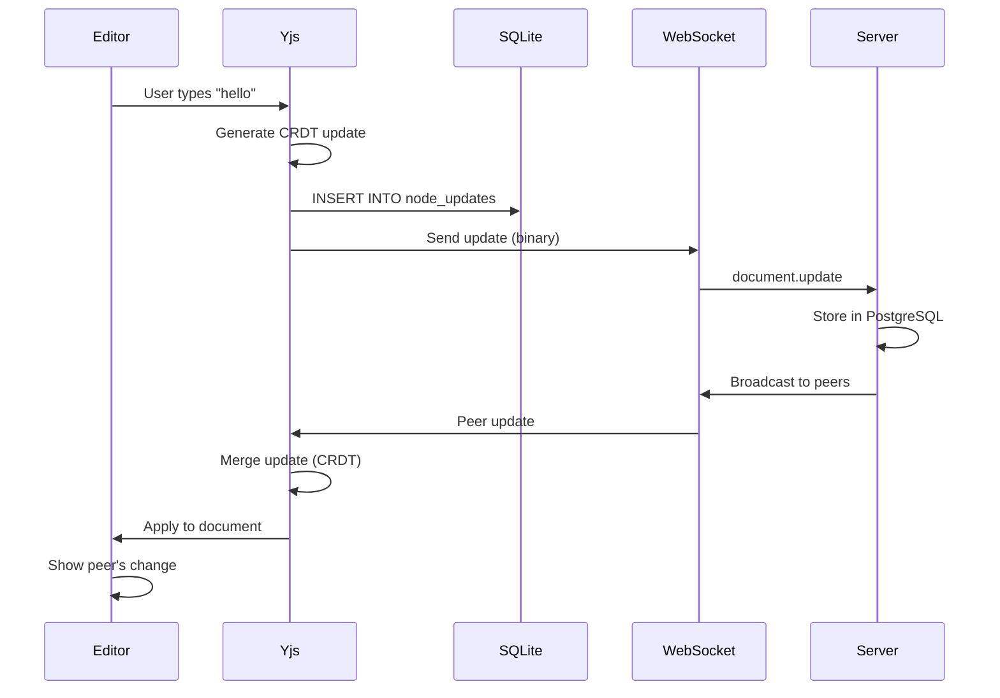
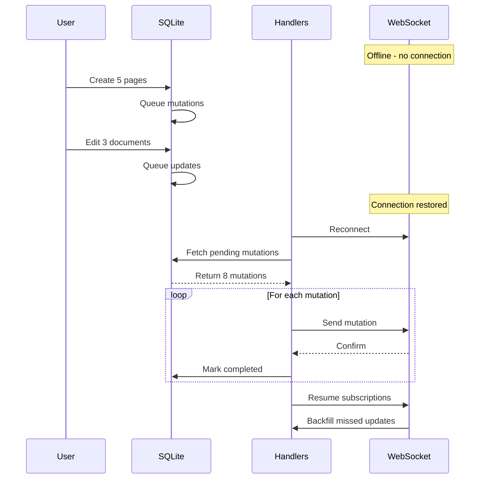

Brainbox's sync engine maintains real-time synchronization between client SQLite databases and the server PostgreSQL database using a WebSocket-based protocol.

## Architecture Overview



## WebSocket Connection

### Client Connection Lifecycle

```typescript
// Client establishes WebSocket connection
import WebSocket from 'isomorphic-ws';

const ws = new WebSocket('wss://brainbox.example.com/api/client/socket');

ws.on('open', () => {
  console.log('WebSocket connected');
  // Start subscribing to data streams
});

ws.on('message', (data) => {
  const message = JSON.parse(data);
  // Route to appropriate handler
});

ws.on('close', () => {
  console.log('WebSocket disconnected');
  // Attempt reconnection with exponential backoff
});
```

### Server WebSocket Handler

```typescript
// apps/server/src/services/socket-service.ts
import { WebSocket } from 'ws';
import { SocketConnection } from './socket-connection';

class SocketService {
  private connections: Map<string, SocketConnection> = new Map();

  async addConnection(id: string, socket: WebSocket) {
    const context = await this.fetchSocketContext(id);
    if (!context) return false;

    const connection = new SocketConnection(
      context,
      socket,
      () => this.connections.delete(context.deviceId)
    );
    
    this.connections.set(context.deviceId, connection);
    return true;
  }
}
```

Location: `apps/server/src/services/socket-service.ts`

### Connection Authentication

1. **Client requests socket ID**: HTTP POST to `/api/client/socket/init`
2. **Server generates socket ID**: Temporary ID stored in Redis (60s TTL)
3. **Client connects**: WebSocket connection to `/api/client/socket?id={socketId}`
4. **Server validates**: Looks up context from Redis, authenticates
5. **Connection established**: Socket bound to user's device ID

### Rate Limiting

WebSocket connections are rate-limited to prevent abuse:

```typescript
// apps/server/src/services/socket-connection.ts
private readonly MESSAGE_RATE_LIMIT = 1000;  // messages
private readonly MESSAGE_RATE_WINDOW = 60000; // 60 seconds

if (this.messageCount > this.MESSAGE_RATE_LIMIT) {
  this.socket.close(1008, 'Rate limit exceeded');
}
```

Limit: 1,000 messages per minute per connection.

## Synchronization Protocol

### Message Types

The sync protocol defines several message types:

#### Input Message (Client → Server)

```typescript
interface SynchronizerInputMessage {
  type: 'synchronizer.input';
  id: string;              // Unique subscription ID
  input: SynchronizerInput; // Subscription parameters
  cursor: string;           // Last known revision
}
```

Example:
```json
{
  "type": "synchronizer.input",
  "id": "sync_abc123",
  "input": {
    "type": "nodes.updates",
    "rootId": "workspace_xyz"
  },
  "cursor": "0"
}
```

#### Output Message (Server → Client)

```typescript
interface SynchronizerOutputMessage<T> {
  type: 'synchronizer.output';
  userId: string;
  id: string;              // Subscription ID
  items: Array<{
    cursor: string;        // New revision
    data: T;              // Update data
  }>;
}
```

Example:
```json
{
  "type": "synchronizer.output",
  "userId": "user_123",
  "id": "sync_abc123",
  "items": [{
    "cursor": "42",
    "data": {
      "id": "node_789",
      "nodeId": "page_456",
      "revision": "42",
      "data": "<base64-encoded-yjs-update>"
    }
  }]
}
```

### Synchronizer Types

Brainbox supports multiple data streams, each with its own synchronizer:

| Type | Description | Location (Client) | Location (Server) |
|------|-------------|-------------------|-------------------|
| `nodes.updates` | Node CRUD operations | `packages/client/src/handlers/` | `apps/server/src/synchronizers/node-updates.ts` |
| `document.updates` | Rich text changes (Yjs) | `packages/client/src/handlers/` | `apps/server/src/synchronizers/document-updates.ts` |
| `collaborations` | Workspace memberships | `packages/client/src/handlers/` | `apps/server/src/synchronizers/collaborations.ts` |
| `node.reactions` | Emoji reactions | `packages/client/src/handlers/` | `apps/server/src/synchronizers/node-reactions.ts` |
| `node.interactions` | View/edit presence | `packages/client/src/handlers/` | `apps/server/src/synchronizers/node-interactions.ts` |
| `node.tombstones` | Soft deletes | `packages/client/src/handlers/` | `apps/server/src/synchronizers/node-tombstones.ts` |
| `users` | User profile updates | `packages/client/src/handlers/` | `apps/server/src/synchronizers/users.ts` |

## Client-Side: Handlers

Client handlers process incoming sync messages and update the local database.

Location: `packages/client/src/handlers/`

### Handler Implementation Pattern

```typescript
// Example: Handling node updates
export class NodeUpdatesHandler {
  async handleMessage(message: SynchronizerOutputMessage) {
    const db = await getDatabase();
    
    for (const item of message.items) {
      const update = item.data;
      
      // Update local database
      await db
        .insertInto('nodes')
        .values({
          id: update.nodeId,
          attributes: update.attributes,
          server_revision: update.revision,
        })
        .onConflict((oc) => oc
          .column('id')
          .doUpdateSet({
            attributes: update.attributes,
            server_revision: update.revision,
          })
        )
        .execute();
      
      // Update sync cursor
      await db
        .insertInto('sync_cursors')
        .values({
          key: `nodes.updates:${update.rootId}`,
          cursor: item.cursor,
        })
        .onConflict((oc) => oc
          .column('key')
          .doUpdateSet({ cursor: item.cursor })
        )
        .execute();
    }
    
    // Invalidate React Query cache
    queryClient.invalidateQueries(['nodes']);
  }
}
```

### Mediator Pattern

The `Mediator` class routes WebSocket messages to appropriate handlers:

```typescript
// packages/client/src/handlers/mediator.ts
export class Mediator {
  private readonly handlers: Map<string, Handler>;
  
  handleMessage(message: Message) {
    if (message.type === 'synchronizer.output') {
      const handler = this.handlers.get(message.id);
      handler?.handleMessage(message);
    }
  }
}
```

Location: `packages/client/src/handlers/mediator.ts:1`

## Server-Side: Synchronizers

Server synchronizers fetch data from PostgreSQL and broadcast to connected clients.

Location: `apps/server/src/synchronizers/`

### Base Synchronizer

All synchronizers extend `BaseSynchronizer`:

```typescript
// apps/server/src/synchronizers/base.ts
export abstract class BaseSynchronizer<T extends SynchronizerInput> {
  public readonly id: string;
  public readonly user: ConnectedUser;
  public readonly input: T;
  public readonly cursor: string;
  
  protected status: SynchronizerStatus = 'pending';
  
  // Fetch initial data when subscription starts
  abstract fetchData(): Promise<SynchronizerOutputMessage<T> | null>;
  
  // Fetch data triggered by event
  abstract fetchDataFromEvent(
    event: Event
  ): Promise<SynchronizerOutputMessage<T> | null>;
}
```

Location: `apps/server/src/synchronizers/base.ts:7`

### Example: Node Updates Synchronizer

```typescript
// apps/server/src/synchronizers/node-updates.ts
export class NodeUpdatesSynchronizer extends BaseSynchronizer<SyncNodesUpdatesInput> {
  
  async fetchData(): Promise<SynchronizerOutputMessage | null> {
    // Fetch updates since cursor
    const nodeUpdates = await database
      .selectFrom('node_updates')
      .selectAll()
      .where('root_id', '=', this.input.rootId)
      .where('revision', '>', this.cursor)
      .orderBy('revision', 'asc')
      .limit(20)
      .execute();
    
    if (nodeUpdates.length === 0) {
      return null;
    }
    
    return {
      type: 'synchronizer.output',
      userId: this.user.userId,
      id: this.id,
      items: nodeUpdates.map((update) => ({
        cursor: update.revision.toString(),
        data: {
          id: update.id,
          nodeId: update.node_id,
          revision: update.revision.toString(),
          data: encodeState(update.data),
        },
      })),
    };
  }
  
  async fetchDataFromEvent(event: Event) {
    // React to node creation/update events
    if (event.type === 'node.created' && event.rootId === this.input.rootId) {
      return this.fetchData();
    }
    return null;
  }
}
```

Location: `apps/server/src/synchronizers/node-updates.ts:15`

### Event-Driven Broadcasting

Synchronizers react to server-side events:

```typescript
// When a node is created, broadcast to subscribed clients
eventBus.publish({
  type: 'node.created',
  nodeId: node.id,
  rootId: node.rootId,
  workspaceId: node.workspaceId,
});

// All synchronizers check if they should fetch new data
for (const synchronizer of activeSynchronizers) {
  const message = await synchronizer.fetchDataFromEvent(event);
  if (message) {
    socket.send(JSON.stringify(message));
  }
}
```

### Synchronizer Registration

```typescript
// apps/server/src/services/socket-connection.ts
const synchronizerClasses = {
  'nodes.updates': NodeUpdatesSynchronizer,
  'document.updates': DocumentUpdateSynchronizer,
  'collaborations': CollaborationSynchronizer,
  'users': UserSynchronizer,
  // ...
};

function createSynchronizer(input: SynchronizerInput) {
  const SynchronizerClass = synchronizerClasses[input.type];
  return new SynchronizerClass(id, user, input, cursor);
}
```

## Sync Flow Examples

### Example 1: Creating a Page



### Example 2: Editing a Document



### Example 3: Offline → Online Sync



## Cursor-Based Synchronization

### How Cursors Work

Cursors track sync progress for each data stream:

```typescript
// Client stores cursor for each subscription
interface SyncCursor {
  key: string;   // e.g., "nodes.updates:workspace_123"
  cursor: string; // e.g., "42" (revision number)
}

// When subscribing, send last known cursor
const cursor = await db
  .selectFrom('sync_cursors')
  .select('cursor')
  .where('key', '=', `nodes.updates:${workspaceId}`)
  .executeTakeFirst();

ws.send(JSON.stringify({
  type: 'synchronizer.input',
  input: { type: 'nodes.updates', rootId: workspaceId },
  cursor: cursor?.cursor || '0',
}));
```

### Incremental Sync

Server only returns data newer than cursor:

```typescript
// Server queries: WHERE revision > cursor
const updates = await database
  .selectFrom('node_updates')
  .where('revision', '>', this.cursor)  // Incremental!
  .orderBy('revision', 'asc')
  .limit(20)  // Batch size
  .execute();
```

This minimizes data transfer and speeds up sync.

### Cursor Updates

Client updates cursor after processing each batch:

```typescript
for (const item of message.items) {
  await processUpdate(item.data);
  
  // Update cursor after successful processing
  await db
    .insertInto('sync_cursors')
    .values({ key: subscriptionKey, cursor: item.cursor })
    .onConflict((oc) => oc.column('key').doUpdateSet({ cursor: item.cursor }))
    .execute();
}
```

## Performance Optimization

### Batching

Updates are sent in batches to reduce message overhead:

```typescript
// Server batches up to 20 updates per message
const BATCH_SIZE = 20;

const updates = await database
  .selectFrom('node_updates')
  .where('revision', '>', cursor)
  .limit(BATCH_SIZE)
  .execute();
```

### Debouncing

Client debounces rapid updates to avoid flooding the server:

```typescript
// Debounce document updates (100ms)
const debouncedSync = debounce(() => {
  syncPendingUpdates();
}, 100);

editor.on('update', () => {
  saveToLocalDatabase();
  debouncedSync();
});
```

### Connection Pooling

Server reuses PostgreSQL connections:

```typescript
// apps/server/src/data/database.ts
const pool = new Pool({
  connectionString: DATABASE_URL,
  max: 20,  // Connection pool size
});
```

## Error Handling

### Connection Errors

```typescript
// Client implements exponential backoff
let retryDelay = 1000; // Start with 1 second

ws.on('close', () => {
  setTimeout(() => {
    reconnect();
    retryDelay = Math.min(retryDelay * 2, 30000); // Max 30s
  }, retryDelay);
});
```

### Sync Errors

```typescript
// If mutation fails, mark in database
await db
  .updateTable('mutations')
  .set({
    status: 'failed',
    error: error.message,
    retry_count: db.fn('retry_count', '+', 1),
  })
  .where('id', '=', mutationId)
  .execute();

// Retry with exponential backoff
if (mutation.retry_count < MAX_RETRIES) {
  await scheduleRetry(mutation, mutation.retry_count);
}
```

### Conflict Resolution

When server version conflicts with local:

1. **CRDT data** (documents): Yjs automatically merges
2. **Metadata** (node attributes): Server version wins
3. **User notified**: Show conflict indicator in UI

## Monitoring and Debugging

### Debug Logging

```bash
# Enable debug logs
DEBUG=brainbox:* npm run dev

# Server logs show sync activity
[brainbox:sync] Node update: page_123 revision 42
[brainbox:sync] Broadcast to 5 connected clients
```

### Metrics

Key metrics to monitor:

- **Active connections**: Number of WebSocket connections
- **Messages/second**: Sync throughput
- **Sync lag**: Time between local write and server confirmation
- **Queue depth**: Pending mutations per client

## Next Steps

- [CRDT Implementation](/architecture/crdt) - How Yjs handles conflicts
- [Local-First Architecture](/architecture/local-first) - Client database design
- [Monorepo Structure](/architecture/monorepo) - Code organization
